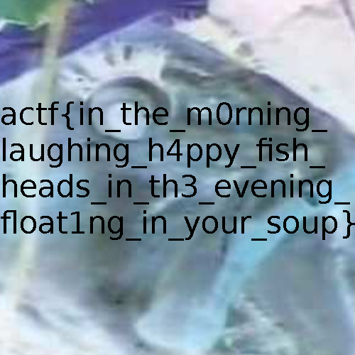

# Fish

## Desctiption

Oh, fish! My [dinner](./fish.png) has turned transparent again. What will I eat now that I can't eat that yummy, yummy, fish head, mmmmmm head of fish mm so good...

## Approach

Using [stegsolve](https://github.com/eugenekolo/sec-tools/tree/master/stego/stegsolve/stegsolve), I loaded the [fish](./fish.png) image and `Color Inversion (Xor)` revealed this image:

## Flag

actf{in_the_m0rning_laughing_h4ppy_fish_heads_in_th3_evening_float1ng_in_your_soup}
